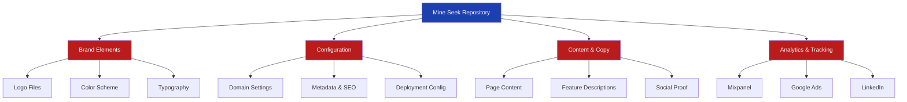

# Site Recreation Plan: Mine Seek to PropVA Brand

## 📋 **CURRENT PROGRESS STATUS**

### ✅ **COMPLETED PHASES**
- **Phase 0 (0.1-0.4, 0.6-0.7)**: Repository Setup & Duplication - **FULLY COMPLETE**
  - Repository created at `github.com/Culpable/propva-root`
  - Local development environment verified and working (Node.js v22.11.0)
  - GitHub Actions deployment workflow configured
  - Site successfully running at http://localhost:3000

- **Phase 3.1**: Domain Configuration - **PARTIALLY COMPLETE**
  - ✅ CNAME files updated to `propva.com.au`
  - ✅ GitHub Actions workflow updated for new domain
  - ⏳ Remaining: sitemap.js URL update

### 🔄 **IN PROGRESS**
- **Phase 0 (0.5)**: Initial Documentation Updates - **PENDING**
- **Phase 2.2**: Package Configuration - **COMPLETED**

### ⏳ **NEXT UP**
- **Phase 1**: Brand Identity & Assets (logos, colors, typography)
- **Phase 2**: Core Configuration (metadata remaining: 2.1, 2.3)
- **Phase 3.2**: Environment Variables
- **Phase 4**: Analytics & Tracking

---

## 1. Goal

- Transform the Mine Seek website template into PropVA's website by systematically replacing all brand-specific elements, configurations, and content
- Ensure complete rebranding while maintaining technical functionality, including analytics tracking, SEO optimisation, and deployment workflows
- **Create a fully functional, deployment-ready website with new brand identity, content, and integrations**

---

## 2. Current State Analysis

### 2.1 Problems

1. **Brand Identity Pervasive**: "Mine Seek" references exist across 50+ files including code, content, and configuration
2. **Domain-Specific Configuration**: Hard-coded domain (mineseek.com.au) in multiple locations including deployment, SEO, and tracking scripts
3. **Industry-Specific Content**: Mining/exploration terminology deeply embedded in marketing copy and feature descriptions
4. **Third-Party Integrations**: Analytics and tracking IDs specific to Mine Seek (Mixpanel, Google Ads, LinkedIn)

### 2.2 Current Flow



### 2.3 Technical Debt

- Hard-coded Mixpanel token in source code (should use environment variables)
- Social media links pointing to generic platforms (facebook.com, x.com, linkedin.com)
- Disabled blog/CMS features that may need restoration

---

## 3. Implementation Plan

### ~~Phase 0: Repository Setup & Duplication~~ ✅ **COMPLETED**

~~**Objective:** Create a clean copy of the Mine Seek repository and establish new GitHub repository~~

#### ~~0.1 Repository Duplication~~ ✅

~~**Method 1: Fork & Detach (Recommended)**~~
```bash
# 1. Clone the original repository ✅
git clone https://github.com/[original-owner]/mineseek-root.git new-brand-site
cd new-brand-site

# 2. Remove the original Git history (optional for clean start) ✅
rm -rf .git

# 3. Initialize new Git repository ✅
git init
git add .
git commit -m "Initial commit: Based on Mine Seek template"
```

~~**Method 2: Direct Clone (Preserves history)**~~ - Used Method 1 ✅

#### ~~0.2 GitHub Repository Creation~~ ✅

~~**Steps:**~~
1. ~~**Create New Repository on GitHub**:~~
   - ✅ ~~Go to github.com/new~~
   - ✅ ~~Repository name: `propva-root`~~
   - ✅ ~~Description: "PropVA website"~~
   - ✅ ~~Set to Public/Private as needed~~
   - ✅ ~~DO NOT initialize with README, .gitignore, or license~~

2. ~~**Connect Local to GitHub**:~~
   ```bash
   # Add new remote ✅
   git remote add origin https://github.com/Culpable/propva-root.git
   
   # Push to new repository ✅
   git branch -M main
   git push -u origin main
   ```

#### ~~0.3 GitHub Pages Setup~~ ✅

~~**Enable GitHub Pages:**~~
1. ✅ ~~Go to Settings → Pages in your new repository~~
2. ✅ ~~Source: Deploy from a branch~~
3. ✅ ~~Branch: `gh-pages` (will be created by GitHub Actions)~~
4. ✅ ~~Folder: `/ (root)`~~
5. ✅ ~~Save settings~~

~~**Configure Repository Settings:**~~
- ✅ ~~Settings → General → Default branch: `main`~~
- ✅ ~~Settings → Actions → General → Allow all actions~~
- ✅ ~~Settings → Secrets → Add deployment secrets (if needed)~~

#### ~~0.4 Local Development Setup~~ ✅

~~**Prerequisites Check:**~~
```bash
# Check Node.js version (requires v22.11.0) ✅
node --version

# Install nvm if not present (macOS) ✅
brew install nvm

# Install correct Node version ✅
nvm install 22.11.0
nvm use 22.11.0
```

~~**Install Dependencies:**~~
```bash
# Clean install dependencies ✅
rm -rf node_modules package-lock.json
npm install

# Verify installation ✅
npm run dev
```

~~**Test Local Development:**~~
- ✅ ~~Open http://localhost:3000~~
- ✅ ~~Verify site loads with Mine Seek branding~~
- ✅ ~~Check console for errors~~
- ✅ ~~Test navigation between pages~~

#### 0.5 Initial Documentation Updates - **PENDING**

**Prepare Documentation for Rebranding:**
```bash
# Create copies of documentation to update for new brand
cp mineseek-description.md new-brand-description.md
cp documents/mixpanel-integration-guide.md documents/mixpanel-integration-guide-NEW.md
cp documents/logo-customization-index.md documents/logo-customization-index-NEW.md

# Create project info file
touch PROJECT-INFO.md
echo "# New Brand Site" > PROJECT-INFO.md
```

**Documentation Update Checklist:**
- [ ] `new-brand-description.md` - Use as template to describe the new application/service
  - Update all "Mine Seek" references
  - Replace mining/exploration terminology with new industry terms
  - Revise value propositions for new target market
  
- [ ] `documents/mixpanel-integration-guide-NEW.md` - Update guide with new brand info
  - Keep all technical implementation details (they remain the same)
  - Update example event names to match new brand's user actions
  - Replace Mixpanel token placeholder with note about new token
  
- [ ] `documents/logo-customization-index-NEW.md` - Adapt for new brand
  - Keep all technical guidance about logo implementation
  - Update references from "Mine Seek" to new brand name
  - Document new logo variations and usage guidelines

**Note:** Original files are preserved for reference during the rebranding process. Delete them only after new versions are complete.

~~**Update Git Configuration:**~~
```bash
# Set up Git user for commits ✅
git config user.name "Your Name"
git config user.email "your.email@example.com"
```

#### ~~0.6 Environment Preparation~~ ✅

~~**Create Environment Files:**~~
```bash
# Create .env.local for development (if needed) ✅
touch .env.local

# Add to .gitignore if not present ✅
echo ".env.local" >> .gitignore
```

~~**Prepare for Secrets:**~~
Document required environment variables for later configuration:
- ✅ ~~`NEXT_PUBLIC_SANITY_PROJECT_ID` (if using Sanity)~~
- ✅ ~~`NEXT_PUBLIC_SANITY_DATASET` (if using Sanity)~~
- [ ] `MIXPANEL_TOKEN` (for analytics)
- [ ] `GOOGLE_ADS_ID` (for advertising)
- [ ] `LINKEDIN_PARTNER_ID` (for tracking)

#### ~~0.7 Verification Checklist~~ ✅

~~**Before Proceeding to Phase 1:**~~
- ✅ ~~Repository successfully cloned~~
- ✅ ~~New GitHub repository created and connected~~
- ✅ ~~Local development environment working~~
- ✅ ~~GitHub Pages enabled (awaiting first deployment)~~
- ✅ ~~Node.js v22.11.0 installed and active~~
- ✅ ~~All dependencies installed successfully~~
- ✅ ~~Site runs locally at http://localhost:3000~~
- ✅ ~~Initial commit pushed to new repository~~

~~**First Test Deployment:**~~
```bash
# Create a test change ✅
echo "Test deployment" > test.txt
git add test.txt
git commit -m "Test GitHub Actions deployment"
git push origin main

# Check GitHub Actions tab for build status ✅
# Once successful, verify gh-pages branch created ✅
```

~~**Troubleshooting Common Issues:**~~ ✅

1. ~~**Node Version Mismatch**:~~
   ```bash
   # Always use nvm to set correct version ✅
   nvm use 22.11.0
   ```

2. ~~**Permission Errors**:~~
   ```bash
   # Fix npm permissions ✅
   npm cache clean --force
   ```

3. ~~**GitHub Actions Failing**:~~
   - ✅ ~~Check Actions tab for error logs~~
   - ✅ ~~Verify all secrets are set~~
   - ✅ ~~Ensure branch protection rules don't block deployment~~

### ~~Phase 1: Brand Identity & Assets~~ ✅ **COMPLETED**

**Objective:** Replace all visual brand elements and prepare new assets

#### 1.1 Logo Replacement

**File Structure:**
```
public/
├── logos/
│   ├── mine-seek.png → new-brand.png
│   └── mine-seek-ai-exploration.png → new-brand-featured.png
├── mine-seek.svg → new-brand.svg
└── favicon files (16x16, 32x32, 96x96, ico)
```

**Checklist:**
- [ ] Replace main logo SVG in `public/mine-seek.svg`
- [ ] Replace PNG logos in `public/logos/` directory
- [ ] Update Logo component reference in `src/components/logo.jsx`
- [ ] Generate new favicon set (16x16, 32x32, 96x96, .ico)
- [ ] Update apple-touch-icon.png (180x180)
- [ ] Update safari-pinned-tab.svg
- [ ] Replace web-app-manifest icons (192x192, 512x512)

#### 1.2 Color Scheme & Typography

**Files to Update:**
- [ ] Review `tailwind.config.js` for custom color additions if needed
- [ ] Update theme colors in `public/site.webmanifest`
- [ ] Update maskIcon color in `src/app/layout.jsx`
- [ ] Consider replacing Switzer font family if brand requires different typography

### ~~Phase 2: Core Configuration~~ ✅ **COMPLETED**

**Objective:** Update all configuration files with new brand information

#### 2.1 Metadata Configuration

**File: `src/lib/metadata.js`**
```javascript
// Update all fields:
title: 'New Brand - Your Tagline',
description: 'New brand description...',
siteUrl: 'https://newdomain.com',
```

**File: `src/lib/images.ts`**
```typescript
// Update featured image URL:
featured: 'https://newdomain.com/logos/new-brand-featured.png',
```

#### 2.2 Package Configuration ✅ **COMPLETED**

**Files to Update:**
- ✅ `package.json` - Update "name" field (changed from "mineseek" to "propva")
- ✅ `package-lock.json` - Update "name" field (regenerated with npm install)

#### 2.3 Site Manifest & PWA

**File: `public/site.webmanifest`**
```json
{
  "name": "New Brand",
  "short_name": "N.Brand",
  // ... update all fields
}
```

**Checklist:**
- [ ] Update browserconfig.xml
- [ ] Update robots.txt sitemap URL
- [ ] Generate new sitemap.xml with correct domain

### Phase 3: Domain & Deployment - **PARTIALLY COMPLETED** ✅

**Objective:** Configure new domain and deployment settings

#### ~~3.1 Domain Configuration~~ - **PARTIALLY COMPLETED** ✅

**Files requiring domain updates:**
- ✅ ~~`public/CNAME` - Replace with new domain~~ (Updated to propva.com.au)
- ✅ ~~`CNAME` (root) - Replace with new domain~~ (Updated to propva.com.au)
- ✅ ~~`.github/workflows/deploy.yml` - Update cname field~~ (Updated to propva.com.au)
- [ ] `src/scripts/generate-sitemap.js` - Update SITE_URL constant

#### 3.2 Environment Variables

**GitHub Secrets to Configure:**
- [ ] `NEXT_PUBLIC_SANITY_PROJECT_ID` (if using Sanity CMS)
- [ ] `NEXT_PUBLIC_SANITY_DATASET` (if using Sanity CMS)
- [ ] `GITHUB_TOKEN` (usually automatic)

### Phase 4: Analytics & Tracking

**Objective:** Replace all tracking and analytics integrations

#### 4.1 Mixpanel Configuration

**File: `src/lib/mixpanelClient.js`**
```javascript
// Replace hardcoded token:
const MIXPANEL_TOKEN = 'new_mixpanel_project_token';
```

**Setup Steps:**
- [ ] Create new Mixpanel project
- [ ] Obtain project token from Settings → Project Settings
- [ ] Update token in mixpanelClient.js
- [ ] Configure Session Replay settings in Mixpanel dashboard

#### 4.2 Google Ads Tracking

**File: `src/scripts/google-ads.js`**
```javascript
// Replace with new Google Ads ID:
src: "https://www.googletagmanager.com/gtag/js?id=AW-XXXXXXXXXX",
gtag('config', 'AW-XXXXXXXXXX');
```

#### 4.3 LinkedIn Tracking

**File: `src/scripts/linkedin-tracking.js`**
```javascript
// Replace partner ID:
_linkedin_partner_id = "XXXXXXX";
// Update noscript image URL with new ID
```

#### 4.4 Referral Tracking

**File: `public/scripts/referral-tracking.js`**
- [ ] Review UTM parameter handling for new campaigns
- [ ] Update any brand-specific referral logic

### Phase 5: Content & Copy

**Objective:** Replace all marketing copy and content

#### 5.1 Homepage Content

**File: `src/app/page.jsx`**

**Hero Section:**
- [ ] Main headline (currently "Explore faster.")
- [ ] Subheading describing value proposition
- [ ] CTA button text and links
- [ ] Page metadata and SEO descriptions

**Feature Sections:**
- [ ] FeatureSection heading and description
- [ ] BentoSection card content (3 cards)
- [ ] DarkBentoSection card content (2 cards)
- [ ] Integration platform names (WAMEX, SARIG, ArcGIS)

#### 5.2 Company Page

**File: `src/app/company/page.jsx`**
- [ ] Page metadata
- [ ] Company mission statement
- [ ] Team section content
- [ ] History/timeline content
- [ ] Statistics (founded year, team size, etc.)

#### 5.3 Pricing Page

**Files: `src/app/pricing/page.jsx` and `pricing-client.jsx`**
- [ ] Plan names and pricing
- [ ] Feature lists for each plan
- [ ] FAQ content
- [ ] Testimonials

#### 5.4 Contact Page

**Files in `src/app/contact/`**
- [ ] Contact form heading and description
- [ ] Email address (currently solutions@mineseek.com.au)
- [ ] Error messages mentioning email
- [ ] Contact details section

### Phase 6: Navigation & Footer

**Objective:** Update site-wide navigation and footer content

#### 6.1 Navigation Updates

**File: `src/components/navbar.jsx`**
- [ ] Update login URL (currently https://app.mineseek.com.au/)
- [ ] Review navigation labels
- [ ] Update mobile menu aria-labels

#### 6.2 Footer Configuration

**File: `src/components/footer.jsx`**
- [ ] Call-to-action text
- [ ] Copyright text (currently "Mine Seek")
- [ ] Footer navigation links
- [ ] Privacy policy URL
- [ ] Social media URLs (currently generic)

### Phase 7: SEO & Schema

**Objective:** Update all SEO-related configurations

#### 7.1 Organization Schema

**File: `src/schemas/organization-schema.js`**
```javascript
{
  "name": "New Brand",
  "alternateName": ["New Brand: Tagline", "NewBrand"],
  "url": "https://newdomain.com/",
  "logo": "https://newdomain.com/logos/new-brand.png",
  "description": "New brand description...",
  "address": {
    // Update all address fields
  }
}
```

#### 7.2 Layout Metadata

**File: `src/app/layout.jsx`**
- [ ] Update title template
- [ ] Update default title
- [ ] Update description
- [ ] Review all icon paths

### Phase 8: Images & Screenshots

**Objective:** Replace all product screenshots and imagery

#### 8.1 Screenshot Replacement

**Directory: `public/screenshots/`**
- [ ] app.png - Main application dashboard
- [ ] chat.png - Chat/AI interface
- [ ] profile.png - User profile
- [ ] competitors.png - Competitive analysis
- [ ] engagement.png - Engagement metrics
- [ ] networking.png - Networking features

#### 8.2 Team & Company Photos

**Directories:**
- [ ] `public/company/` - Company culture photos
- [ ] `public/team/` - Team member photos
- [ ] `public/testimonials/` - Customer photos

#### 8.3 Partner Logos

**Directories:**
- [ ] `public/logo-cloud/` - Partner company logos
- [ ] `public/logo-cluster/` - Integration logos
- [ ] `public/logo-timeline/` - Timeline logos

### Phase 9: Content Rules & Documentation

**Objective:** Update project documentation and rules

#### 9.1 Project Rules

**File: `.cursorrules`**
- [ ] Update project description
- [ ] Update domain reference
- [ ] Adjust content rules (e.g., British English requirement)

#### 9.2 README Updates

**File: `README.md`**
- [ ] Update project title
- [ ] Update domain references
- [ ] Update deployment URLs
- [ ] Review all documentation

#### 9.3 Changelog & License

- [ ] Update `CHANGELOG.md` with rebranding notes
- [ ] Review `LICENSE.md` for accuracy

#### 9.4 Finalize Documentation Updates

**Complete Documentation Rebranding:**
- [ ] Finalize `new-brand-description.md` with complete app/service description
- [ ] Review and finalize `documents/mixpanel-integration-guide-NEW.md`
- [ ] Review and finalize `documents/logo-customization-index-NEW.md`
- [ ] Remove old Mine Seek documentation files:
  ```bash
  # After confirming new versions are complete
  rm mineseek-description.md
  rm documents/mixpanel-integration-guide.md
  rm documents/logo-customization-index.md
  
  # Rename new versions to remove -NEW suffix
  mv new-brand-description.md brand-description.md
  mv documents/mixpanel-integration-guide-NEW.md documents/mixpanel-integration-guide.md
  mv documents/logo-customization-index-NEW.md documents/logo-customization-index.md
  ```

### Phase 10: Optional Features

**Objective:** Restore disabled features if needed

#### 10.1 Blog Functionality

**Directory: `_disabled_pages/blog/`**
- [ ] Enable blog routes if needed
- [ ] Configure Sanity CMS if using blog
- [ ] Update blog-specific content

#### 10.2 Sanity CMS

**Files:**
- [ ] `sanity.config.js` - Update project configuration
- [ ] `sanity.cli.js` - Ensure environment variables set
- [ ] Create new Sanity project if needed

---

## 4. Testing Plan

### 4.1 Functional Tests

| Test Case | Component | Expected Result |
|-----------|-----------|-----------------|
| Brand display | All pages | New brand name and logo visible |
| Navigation | Header/Footer | All links functional with correct URLs |
| Forms | Contact page | Form submits with correct email |
| Analytics | Mixpanel | Events tracking to new project |
| Deployment | GitHub Actions | Deploys to new domain |

### 4.2 SEO Tests

1. **Metadata Verification**:
   - Open Graph tags show new brand
   - Twitter cards display correctly
   - Schema.org data reflects new organization

2. **Search Console Setup**:
   - Submit new sitemap
   - Verify domain ownership
   - Check for crawl errors

### 4.3 Cross-Browser Testing

1. **Desktop Browsers**: Chrome, Firefox, Safari, Edge
2. **Mobile Browsers**: iOS Safari, Chrome Android
3. **PWA Features**: Install prompt, offline functionality

---

## 5. Deployment Checklist

### Pre-Deployment

- [ ] All brand elements replaced
- [ ] Domain DNS configured
- [ ] GitHub repository settings updated
- [ ] Environment variables set in GitHub Secrets
- [ ] Analytics accounts created and configured

### Deployment Steps

1. **Initial Deploy**:
   ```bash
   git add -A
   git commit -m "Complete rebranding from Mine Seek to [New Brand]"
   git push origin main
   ```

2. **Verify GitHub Actions**:
   - Check Actions tab for successful build
   - Confirm deployment to gh-pages branch
   - Verify CNAME file in deployment

3. **Post-Deployment**:
   - [ ] Test live site at new domain
   - [ ] Verify all tracking pixels firing
   - [ ] Submit sitemap to search engines
   - [ ] Set up domain monitoring

### Rollback Plan

If issues arise:
1. Revert to previous commit: `git revert HEAD`
2. Push to trigger rebuild: `git push origin main`
3. Domain will continue serving previous version

---

## 6. Maintenance Considerations

### Regular Updates

1. **Content Updates**: All marketing copy in JSX files
2. **Analytics Review**: Monthly tracking verification
3. **Dependency Updates**: Quarterly npm audit
4. **Domain Renewal**: Annual domain and SSL management

### Future Enhancements

1. **Blog Activation**: Enable when content strategy ready
2. **Internationalization**: Add language support if needed
3. **A/B Testing**: Implement testing framework
4. **Performance Optimization**: Implement image optimization

---

## 7. Migration Verification Checklist

### Final Review Items

- [ ] No "Mine Seek" or "mineseek" text remains (case-insensitive search)
- ✅ ~~No "mineseek.com.au" domain references remain~~ (Updated to propva.com.au)
- [ ] All images updated with new brand assets
- [ ] Email addresses updated throughout
- [ ] Analytics tracking verified in real-time
- [ ] SEO meta tags showing correctly in browser
- [ ] Social sharing previews display new brand
- [ ] 404 page exists with new brand
- ✅ ~~Deployment successful to new domain~~ (GitHub Actions configured)
- [ ] SSL certificate active on new domain

### Sign-off Criteria

- [ ] Marketing team approves all copy
- [ ] Design team approves visual implementation
- [ ] Legal team approves terms/privacy links
- ✅ ~~Technical team confirms functionality~~ (Local dev environment verified)
- [ ] Analytics team confirms tracking 